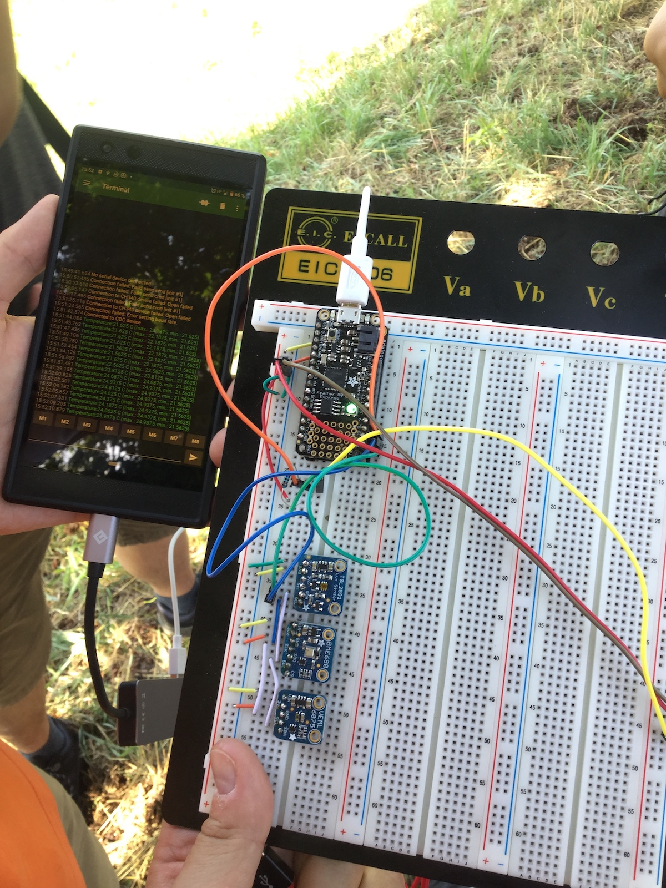

# Electronics project at Summer lab 2019 in Ostritz
During the summer lab 2019 at [Internationales Begegnungszentrum St. Marienthal](https://ibz-marienthal.de/) in Ostritz, organized by the [DLR_School_Lab TU Dresden](https://www.dlr.de/schoollab/tu-dresden), we built a station for weather and environmental data programmed in [CircuitPython](https://circuitpython.org/) to support the (micro-)plastics studies in Polish, German and Czech running waters.

This project is embeddeed into the fifth round of the citizen science project [„Plastikpiraten“](https://www.forschungs-werkstatt.de/aktuelles/plastikpiraten-waren-unterwegs/) of the [Kieler Forschungswerkstatt](https://www.forschungs-werkstatt.de/).

We'd like to thank [Deutsch-Polnisches-Jugendwerk (DPJW)](https://www.dpjw.org/) for their kind support.